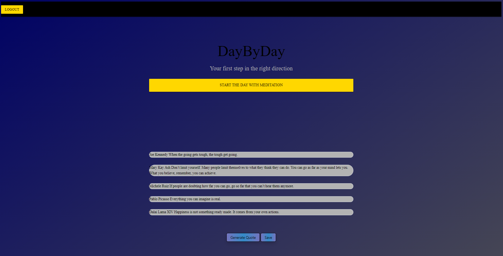
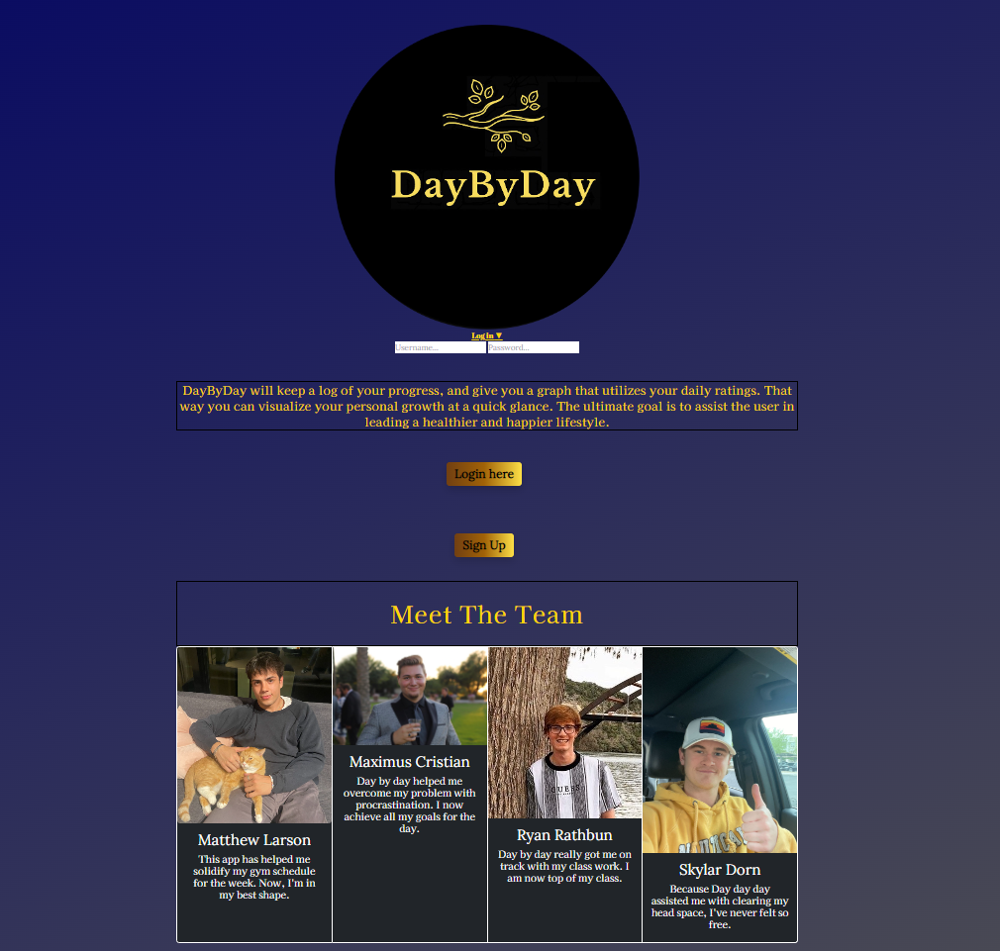

# DayByDay

## User Story

Studies show that young adults between the ages of 18-29 express difficulties motivating themselves at a high rate of 53%. Do you find yourself to fall into that demographic? Not to worry, The DayByDay app is intended to help motivate, track, and help you stay consistent in a category of your choosing! 

## Table of Contents

[Installation](#installation)
[Usage](#usage)
[Credits](#credits)
[License](#license)

## Installation

We utiilized serverall third-party applications to increase the flow of our project. This includes, but is not limited to, bcrypt, axios, express, sequelize, etc.

## Usage

Login, or sign up to access the main page. The main page is presented with previously saved quotes, as well as data to show user progress. Generate a quote to recieve your daily pick-me-up, save it to your user-profile if valueable to you. 

## License 

© 2022 Trilogy Education Services, LLC, a 2U, Inc. brand. Confidential and Proprietary. All Rights Reserved.

